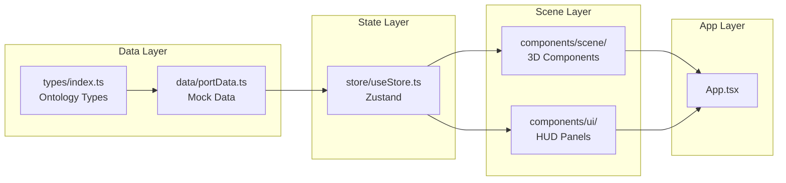
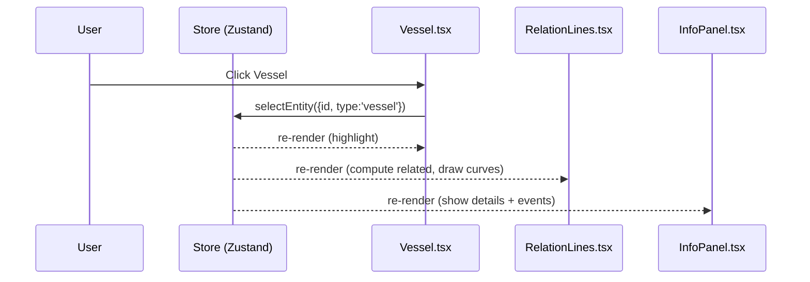

# 시스템 구조

## 아키텍처 개요

## 4개 레이어

### 1. Data Layer

- **`src/types/index.ts`** — TypeScript 타입 정의 (온톨로지)
- **`src/data/portData.ts`** — 정적 mock 데이터 (부산항)

향후 실제 API 연동 시 이 레이어만 교체하면 됩니다.

### 2. State Layer

- **`src/store/useStore.ts`** — Zustand 기반 단일 스토어
- 책임:
    - 선택된 엔티티 관리 (`selectedEntity`, `hoveredEntity`)
    - 오버레이 모드 (`overlayMode`)
    - 표시 토글 (`showRelations`, `showLabels`, `showGraphView`)
    - 관계 추론 헬퍼 (`getRelatedEntities`, `getEventsForEntity`)

### 3. Scene Layer

#### `components/scene/` (3D)

| 파일 | 책임 |
|---|---|
| `PortScene.tsx` | Canvas 루트, 라이팅, 카메라, 모든 객체 합성 |
| `Environment.tsx` | Water, Ground, Quay |
| `Terminal.tsx` | 터미널 박스 (혼잡도 색상) |
| `Berth.tsx` | 선석 슬롯 (status 색상) |
| `YardBlock.tsx` | 야드 (높이 = 적치율) |
| `Gate.tsx` | 게이트 + 펄스 애니메이션 |
| `Vessel.tsx` | 선박 hull + 데크 컨테이너 + CO2 plume |
| `RelationLines.tsx` | 선택 시 Bezier 관계 라인 |
| `EventMarkers.tsx` | 이벤트 마커 (오버레이별 필터링) |

#### `components/ui/` (HUD)

| 파일 | 책임 |
|---|---|
| `StatusBar.tsx` | 상단 좌측 메트릭 (점유율/적치율/CO2/알림) |
| `InfoPanel.tsx` | 상단 우측 상세 정보 + 관련 객체 |
| `ControlPanel.tsx` | 하단 좌측 오버레이/토글 |
| `KnowledgeGraph.tsx` | 전체 화면 노드-엣지 그래프 |

### 4. App Layer

- **`src/App.tsx`** — Scene + UI 합성
- **`src/main.tsx`** — React entry point

## 데이터 흐름

## 다음 단계

→ [컴포넌트 구성](components.md) 에서 각 컴포넌트의 책임과 props를 확인하세요.
→ [상태 관리](state.md) 에서 Zustand store 구조를 확인하세요.
