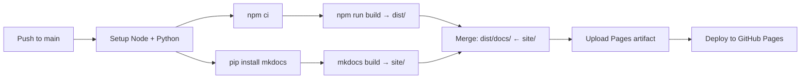

# 배포

본 프로젝트는 **GitHub Actions + GitHub Pages**로 자동 배포됩니다.

## 배포 구조

```
https://yeongseon.github.io/maritime-viz/        ← Vite 앱 (3D 시각화)
https://yeongseon.github.io/maritime-viz/docs/   ← MkDocs 문서
```

두 사이트는 **하나의 워크플로우**로 함께 빌드되어 단일 GitHub Pages 배포에 포함됩니다.

## 워크플로우 개요

`.github/workflows/deploy.yml`:



## 워크플로우 파일

```yaml
name: Deploy
on:
  push:
    branches: [main]
  workflow_dispatch:

permissions:
  contents: read
  pages: write
  id-token: write

concurrency:
  group: pages
  cancel-in-progress: false

jobs:
  build-and-deploy:
    runs-on: ubuntu-latest
    environment:
      name: github-pages
      url: ${{ steps.deployment.outputs.page_url }}
    steps:
      - uses: actions/checkout@v4
      - uses: actions/setup-node@v4
        with:
          node-version: 20
          cache: npm
      - uses: actions/setup-python@v5
        with:
          python-version: '3.11'
      - run: npm ci
      - run: npm run build
      - run: pip install -r docs-requirements.txt
      - run: mkdocs build
      - run: mkdir -p dist/docs && cp -r site/* dist/docs/
      - uses: actions/configure-pages@v5
      - uses: actions/upload-pages-artifact@v3
        with:
          path: dist
      - id: deployment
        uses: actions/deploy-pages@v4
```

## 처음 설정하기

GitHub 저장소에서:

1. **Settings** → **Pages**
2. **Source**를 **GitHub Actions**로 설정 (gh-pages 브랜치 X)
3. main 브랜치에 push → 자동 배포 시작
4. Actions 탭에서 진행 상태 확인
5. 약 2~3분 후 두 URL 접속 가능

## 수동 배포 트리거

```bash
gh workflow run deploy.yml
```

또는 GitHub Actions UI에서 **Run workflow** 버튼 클릭.

## 로컬에서 배포 미리보기

### 앱

```bash
npm run build
npm run preview
```

→ http://localhost:4173/maritime-viz/

### 문서

```bash
mkdocs serve
```

→ http://127.0.0.1:8000/maritime-viz/docs/

## 트러블슈팅

### 앱이 빈 화면으로 보임

`vite.config.ts`의 `base` 설정 확인:

```typescript
base: '/maritime-viz/',
```

Repo 이름이 다르면 base도 변경 필요.

### 문서 링크가 깨짐

`mkdocs.yml`의 `site_url` 확인:

```yaml
site_url: https://yeongseon.github.io/maritime-viz/docs/
```

### 404 페이지

GitHub Pages 캐시일 수 있음. 5~10분 후 재시도.
