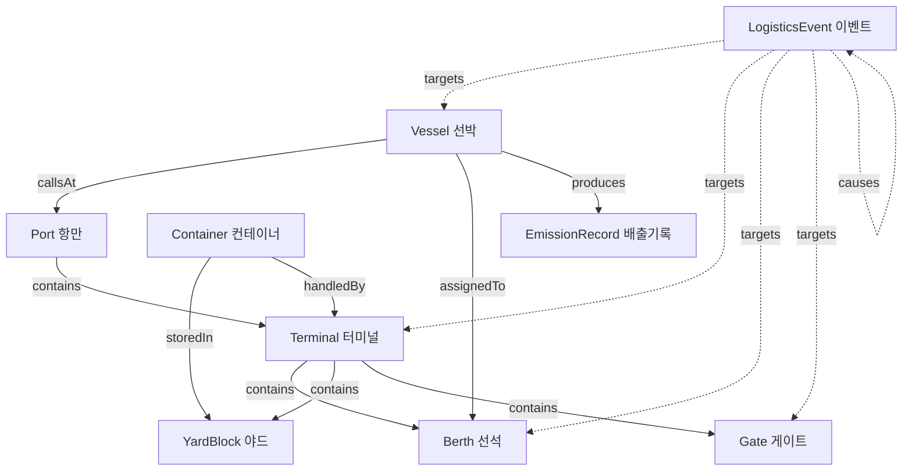

# 온톨로지 스키마

본 프로젝트는 해운물류 도메인을 **9개 핵심 클래스**와 **11개 관계 타입**으로 구조화합니다.

## 클래스 계층도

## 핵심 클래스

### Vessel (선박)

| 속성 | 타입 | 설명 |
|---|---|---|
| `id` | string | 고유 식별자 |
| `name` | string | 선박명 (예: MV Horizon) |
| `type` | enum | container / bulk / tanker |
| `status` | enum | approaching / waiting / berthed / departing |
| `eta`, `etd` | ISO datetime | 도착/출발 예정 시간 |
| `assignedBerth` | string \| null | 배정된 선석 ID |
| `capacity`, `currentLoad` | number | TEU 단위 적재 용량 / 현재 적재량 |
| `co2EmissionRate` | number | 시간당 CO2 배출량 (톤) |

### Port (항만)

| 속성 | 타입 | 설명 |
|---|---|---|
| `id` | string | 고유 식별자 |
| `name`, `nameKo` | string | 영문/한글 이름 |
| `terminals` | string[] | 소속 터미널 ID 목록 |

### Terminal (터미널)

| 속성 | 타입 | 설명 |
|---|---|---|
| `portId` | string | 소속 항만 |
| `yardUtilization` | 0~1 | 야드 적치율 |
| `gateQueueLength` | number | 게이트 대기 차량 수 |
| `congestionLevel` | enum | low / medium / high / critical |

### Berth (선석)

| 속성 | 타입 | 설명 |
|---|---|---|
| `terminalId` | string | 소속 터미널 |
| `length` | number | 선석 길이 (m) |
| `status` | enum | available / occupied / maintenance |
| `assignedVessel` | string \| null | 접안 중인 선박 |

### YardBlock (야드 블록)

| 속성 | 타입 | 설명 |
|---|---|---|
| `terminalId` | string | 소속 터미널 |
| `utilization` | 0~1 | 적치율 |
| `containerCount` | number | 현재 적치된 컨테이너 수 |
| `maxCapacity` | number | 최대 적치 가능 수 |

### Gate (게이트)

| 속성 | 타입 | 설명 |
|---|---|---|
| `queueLength` | number | 대기 차량 수 |
| `avgWaitMinutes` | number | 평균 대기 시간 |
| `status` | enum | open / congested / closed |

### Container (컨테이너)

| 속성 | 타입 | 설명 |
|---|---|---|
| `status` | enum | on_vessel / yard / on_truck / warehouse |
| `vesselId`, `yardBlockId` | string \| null | 현재 위치 |
| `dwellTimeHours` | number | 체류 시간 |
| `destination` | string | 최종 목적지 |

### LogisticsEvent (이벤트)

| 속성 | 타입 | 설명 |
|---|---|---|
| `type` | enum | delay / congestion / weather / equipment_failure / emission_alert |
| `severity` | enum | info / warning / critical |
| `targetId`, `targetType` | string | 영향 객체 |
| `cause` | string | 원인 코드 |
| `relatedEntities` | string[] | 연관 객체 목록 |

### EmissionRecord (배출 기록)

| 속성 | 타입 | 설명 |
|---|---|---|
| `sourceId`, `sourceType` | string | 배출 주체 |
| `co2Tons` | number | CO2 배출량 (톤) |
| `fuelConsumptionTons` | number | 연료 소비량 (톤) |

## 다음 단계

→ [관계 정의](relations.md) 에서 11개 관계 타입의 상세 의미를 확인하세요.
→ [데이터 모델](data-model.md) 에서 실제 데이터 예시를 확인하세요.
