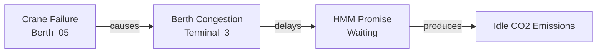

# 시나리오 2. 지연 원인 탐색

## 페르소나

**물류 담당자 (이대리, 30세)**
> "HMM Promise가 왜 지연되고 있는지 추적해야 한다."

## 단계별 흐름

### Step 1. Delay 오버레이 켜기

컨트롤 패널 → **⏱ Delay** 클릭

```
변화:
  - 모든 delay/congestion 이벤트 마커가 펄스 sphere로 표시
  - HMM Promise 위에 빨간 펄스 마커 (critical)
```

### Step 2. HMM Promise 마커 호버

마커에 마우스 호버 → 즉시 라벨 표시:

```
⏱ DELAY
"HMM Promise waiting for berth assignment due to maintenance on B-5..."
```

### Step 3. HMM Promise 선택

선박 클릭 → InfoPanel에 상세 표시.

```
VESSEL: HMM Promise
  Status: WAITING         (주황)
  Capacity: 10,500 / 14,000 TEU (75%)
  ETA: 14:00
  ETD: 02:00 (다음날)
  CO2 Rate: 3.8 t/hr      (빨강)

Events (2):
  🔴 delay (critical)
    "HMM Promise waiting for berth assignment due to
     maintenance on B-5"
  ⚠ emission_alert (warning)
    "HMM Promise idle emissions accumulating during
     anchorage wait"

Related (5):
  [berth_07] [berth_05] [terminal_3]
  [evt_001]  [evt_004]  [evt_005]
```

### Step 4. 관계 라인으로 시각적 확인

HMM Promise부터 berth_07, berth_05, terminal_3로 라인이 그려짐.

→ **B-5 정비 → B-7 배정 대기**임을 한눈에 파악.

### Step 5. 원인 이벤트 추적

InfoPanel의 `[evt_006]` 또는 berth_05 클릭:

```
BERTH: B-5
  Status: MAINTENANCE     (빨강)

Events (1):
  🔴 equipment_failure (critical)
    "Gantry crane #3 at B-5 offline for emergency repair"
```

→ 진짜 근본 원인은 **B-5의 갠트리 크레인 고장**이었음.

### Step 6. 인과 체인 정리



이 체인은 온톨로지의 `causes` 관계 + `relatedEntities`로 표현되어 있어 자동으로 추적 가능.

## 결과

6단계, 약 90초 이내에:

- ✅ 지연 선박 식별 (HMM Promise)
- ✅ 직접 원인 (B-7 미배정)
- ✅ 근본 원인 (B-5 크레인 고장)
- ✅ 부수 효과 (대기 중 CO2 발생)
- ✅ 영향 범위 (terminal_3 전체)

## 의사결정 지원

이 정보로 운영자는:

- B-5 수리 우선순위 상향
- HMM Promise를 다른 가용 선석(B-3)으로 재배정 검토
- Terminal_2의 가용 선석 점검 (B-4 사용 중, B-5 정비)

→ 단순 "지연" 알람이 아니라 **의사결정 가능한 정보**로 변환됨.
