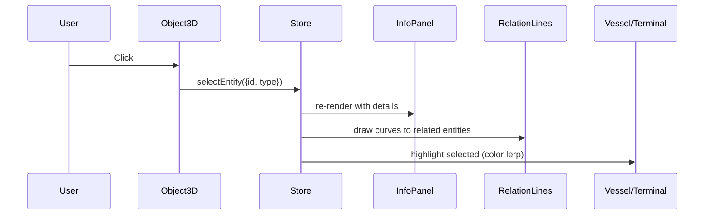

# 인터랙션

## 카메라 컨트롤

| 동작 | 결과 |
|---|---|
| 마우스 좌클릭 + 드래그 | 카메라 회전 (orbit) |
| 마우스 우클릭 + 드래그 | 카메라 이동 (pan) |
| 휠 스크롤 | 줌 인/아웃 |
| 터치 (모바일) | 1손가락 회전 / 2손가락 줌·이동 |

### 카메라 제약

- `minDistance`: 10 (너무 가까이 들어가지 않도록)
- `maxDistance`: 80 (너무 멀어지지 않도록)
- `maxPolarAngle`: π/2.1 (지면 아래로 들어가지 않도록)
- `target`: [5, 0, 0] (항만 중심 고정)

## 객체 선택

### 선택 흐름

### 선택 시 시각 변화

- 선택 객체 → 색상이 `#60a5fa`로 lerp 전환
- 선택 객체 위에 **glow sphere** 표시
- 관련 객체로 **3D 관계 라인** 그려짐
- **InfoPanel**에 상세 정보 표시
- 관련 객체 ID 목록이 **버튼으로 표시** → 클릭 시 해당 객체로 이동

### 선택 해제

- 빈 공간 클릭 (`onPointerMissed`)
- InfoPanel의 × 버튼

## 호버

| 객체 | 호버 시 표현 |
|---|---|
| 모든 클릭 가능 객체 | 색상 약간 밝아짐 (`#94a3b8` lerp) |
| Yard, Vessel | 라벨 자동 표시 (호버 + Labels ON) |

## 컨트롤 패널

### 오버레이 모드 (4종)

| 버튼 | 효과 |
|---|---|
| 🌐 Default | 기본 색상으로 모든 객체 표시 |
| 🚧 Congestion | 터미널/야드를 혼잡도 색상으로 매핑 |
| ⏱ Delay | 지연·혼잡 이벤트 마커 강조 |
| 🌿 Carbon | 선박 위 CO2 plume 표시 + Carbon 메트릭 강조 |

### 토글 (3종)

| 버튼 | 효과 |
|---|---|
| Relations | 관계 라인 표시/숨김 |
| Labels | 객체 라벨 표시/숨김 |
| Graph | Knowledge Graph 뷰로 전환 |

## InfoPanel 인터랙션

### 닫힌 상태 (선택 없음)

- 항만 전체 통계 (Terminals/Vessels/Berths/Events) 표시

### 열린 상태 (선택 있음)

- 선택 객체 타입 + 이름
- 동적 필드 (status, capacity, ETA 등 — 타입별로 다름)
- 관련 이벤트 목록 (severity 색상 구분)
- 관련 객체 버튼 (클릭 시 선택 이동)

## Knowledge Graph 인터랙션

- 노드 클릭 → 메인 뷰의 선택 상태 동기화
- 자체 OrbitControls로 그래프 회전·줌
- "Back to 3D Port" 버튼으로 메인 뷰 복귀
- 노드는 미세 bobbing 애니메이션 (시각적 활기)

## 키보드 (향후 추가 예정)

| 단축키 | 효과 |
|---|---|
| `Esc` | 선택 해제 |
| `G` | Graph 뷰 토글 |
| `1`~`4` | 오버레이 모드 전환 |
| `R` | 카메라 리셋 |

!!! note
    현재 MVP에는 키보드 단축키가 구현되어 있지 않습니다. [로드맵](../roadmap.md) 참조.
